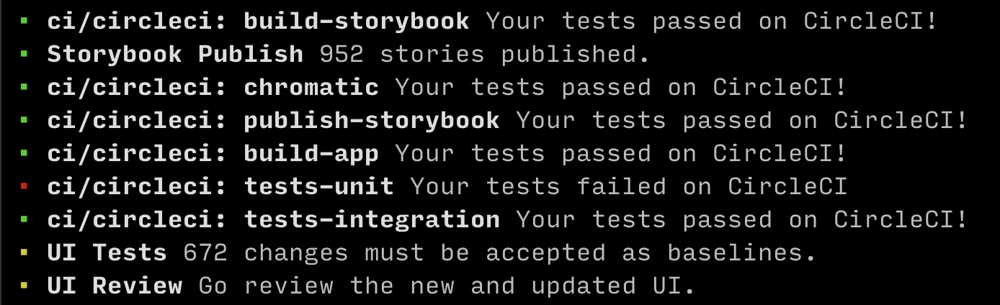

# gh-watch

A GitHub (`gh`) CLI extension to watch commit statuses and releases.

- Displays statuses with a visual indicator and a link to details about the status
- Sends an OS-level notification when the commit status is no longer "pending"
- With the optional `--release`/`-r` parameter, shows new releases when the status is no longer "pending"
- With the optional `--branch` parameter, watches a branch instead of a specific commit



## Installation

1. [Install the GitHub CLI](https://github.com/cli/cli#installation).

2. Install the extension.
   ```shell
   gh extension install AdamVig/gh-watch
   ```

## Usage

```shell
# In a GitHub repository

gh watch

gh watch --release
gh watch -r

gh watch --branch
```
